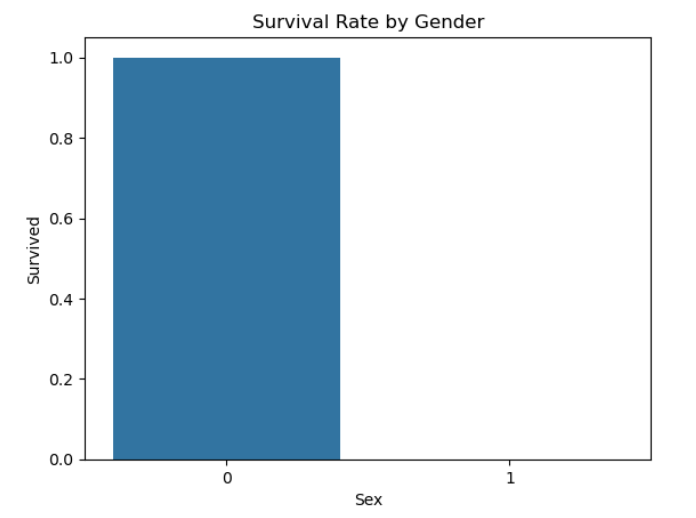
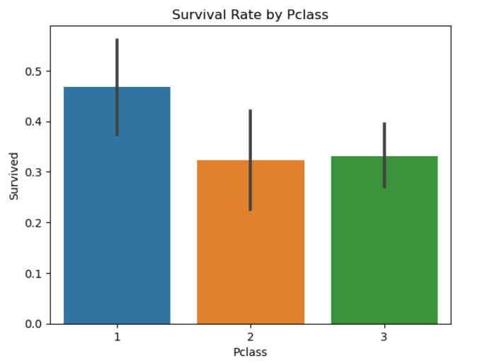
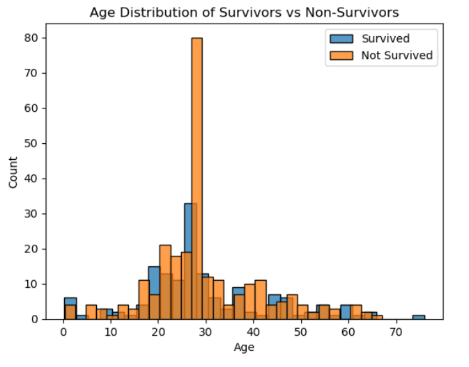

# CodeAlpha_Titanic_Survival_Prediction_Task_1

# Titanic Survival Prediction

This project aims to predict whether a passenger would survive the Titanic disaster using machine learning techniques. The dataset used is from Kaggle and contains various features like socio-economic status, age, gender, and more.

## Table of Contents

- [Installation](#installation)
- [Usage](#usage)
- [Project Structure](#project-structure)
- [Models Used](#models-used)
- [Results](#results)
- [Feature Importance](#feature-importance)
- [Visualizations](#visualizations)
- [Contributing](#contributing)
- [License](#license)

## Installation

1. Clone the repository:
    ```bash
    git clone https://github.com/rohitshinde3903/CodeAlpha_Titanic_Survival_Prediction_Task_1.git
    cd CodeAlpha_Titanic_Survival_Prediction_Task_1
    ```

2. Create and activate a virtual environment (optional but recommended):
    ```bash
    python3 -m venv venv
    source venv/bin/activate
    ```

3. Install the required packages:
    ```bash
    pip install -r requirements.txt
    ```

## Usage

1. Ensure you have the Titanic dataset (`titanic.csv`) in the project directory. You can download the dataset from [Kaggle](https://www.kaggle.com/c/titanic/data).

2. Run the Jupyter Notebook:
    ```bash
    jupyter notebook Titanic_Survival_Prediction.ipynb
    ```

3. Follow the steps in the notebook to understand the data preprocessing, model building, evaluation, and visualization process.

## Project Structure

titanic-survival-prediction/

├── Titanic_Survival_Prediction.ipynb

├── titanic.csv

├── requirements.txt

├── README.md

└── Images

     ├── survival_rate_by_pclass.png
 
     ├── survival_rate_by_gender.png
 
     └── age_distribution.png


- `Titanic_Survival_Prediction.ipynb`: Jupyter Notebook containing the entire project code.
- `titanic.csv`: Dataset file.
- `requirements.txt`: List of required packages for the project.
- `README.md`: Project documentation.

## Models Used

1. **Logistic Regression**
2. **Random Forest Classifier**

## Results

### Logistic Regression
- **Accuracy**: 81.56%
- **Classification Report**:
    ```
    precision    recall  f1-score   support

           0       0.84      0.86      0.85       105
           1       0.78      0.75      0.76        74

    accuracy                           0.82       179
    macro avg       0.81      0.81      0.81       179
    weighted avg       0.82      0.82      0.82       179
    ```
- **Confusion Matrix**:
    ```
    [[90 15]
     [18 56]]
    ```

### Random Forest Classifier
- **Accuracy**: 84.36%
- **Classification Report**:
    ```
    precision    recall  f1-score   support

           0       0.85      0.90      0.88       105
           1       0.83      0.76      0.79        74

    accuracy                           0.84       179
    macro avg       0.84      0.83      0.83       179
    weighted avg       0.84      0.84      0.84       179
    ```
- **Confusion Matrix**:
    ```
    [[95 10]
     [18 56]]
    ```

## Feature Importance

The Random Forest model's feature importance analysis shows the following:
- **Sex**: Most important factor.
- **Pclass**: Second most important factor.
- **Fare**: Third most important factor.

## Visualizations

### Survival Rate by Gender


### Survival Rate by Pclass


### Age Distribution of Survivors vs Non-Survivors


## Contributing

Contributions are welcome! Please feel free to submit a Pull Request.


